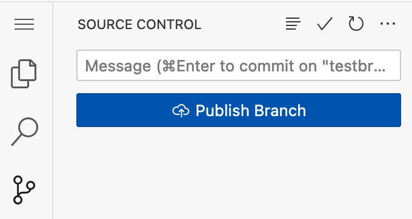

# chirpy

For the next few homework assignments, you will be incrementally building a Twitter-like service.  I've called my service Chirpy, but you should call yours something different.  Later in the semester, we'll get domain names for each group's service (e.g., chirpyposts.com).

Throughout this document, I'll be using the name Chirpy.  And yes, I know that Twitter is now called $\mathcal{X}$, but I'm just not gonna call it that.  And no, I won't rebrand Chirpy as $\mathcal{C}$.

# A Tour of Chirpy

## Assignment Goals

The goal of this assignment is to provide experiential learning in which students participate in a significant group project, working together to construct a sophisticated and complex software system.  Secondary goals include experience with the following:

* design documents;
* code documentation;
* adhering to style guidelines;
* test cases; 
* web programming; and
* source code management, including branching and merging

## What is Chirpy?

Chirpy is a Twitter-like service in which users, who are called *chirpers*, can post short messages or *chirps*.  Chirps can contain #hashtags, which are identified as any word that begins with a # symbol.

After logging in, the main screen for Chirpy is the *timeline*, which constitutes the logged-in user's feed.  Populating the timeline are chirps from the logged-in user's *contacts*.  Contacts are fellow Chirpers.  

There is also a **search functionality**, where a Chirper can either:
1. type in the name of another Chirper and view that latter Chirper's chirps (unless that latter Chirper's profile is set to private; see note below); or 
2. search for posts that contain a given hashtag.

For example, a Chirper named `Micah1` can either search for Chirps from another Chirper, say, `DeGioia`, or for a hashtag, say, `#Georgetown`.

## Requirements

This project is purposefully left somewhat open ended (so that you may exercise your creativity!), and I've tried to keep the requirements minimal.  They are:

* Your implementation must implement the logic described in the previous section (i.e., allow Chirps, searching, etc.).

* Anyone can register for an account on Chirpy.  Chirpers have a username and a password.

* After registering, a chirper must log into the service using its correct username and password.

* A chirper's account is public by default (meaning that any logged in user can view their chirps), but can be set to private by that user, meaning that the chirper's chirps are only viewable by that chirper's contacts.

* You can specify a maximum length for Chirps, but it must be at least 128 characters.

## Extra Features

Additionally, your project should support at least one additional functionality:

* Moderation mode in which site operators can remove posts and suspend (and unsuspend) accounts.

* Support for full-text searching of chirps.

* Support for uploading images or linking to videos in Chirps.

* Support for interacting with ChatGPT or other large language model chat bots.  (Talk to me if you are attempting this, since it might cost money, and I might be able to cover it.)

* Something clever that I haven't thought of.  This requires TA or instructor approval.

## A Brief Warning

Please don't blindly release your project to the world.  You should probably password protect it with a site-wide password.  (If you do that, you'll need to tell us what it is.)

Completely unmoderated social networks will quickly get overrun by horrible (and potentially illegal) content.  Running a real social network is expensive and difficult, and this course project isn't going to prepare you for that.

# Let's get into the details...

## Overall Structure

Chirpy is currently divided into three main packages:

* [data access object (DAO)](/src/main/java/edu/georgetown/dao/): contains classes that represent the various data objects for Chirpy.  These will likely include Chirper (a user), Chirp (a post), AuthenticationCookie (used to maintain state after logging in), among others.  

* [business logic layer (BLL)](/src/main/java/edu/georgetown/bll/): contains classes that implement the core logic of Chirpy.  This will likely include a UserRegistrationService, a UserAuthenticationService, a ChirpService, and a SearchService.  Consider this the place to put the core logic of your program.  The BLL will likely frequently make use of the data objects in the DAO package.

* [display logic (DL)](/src/main/java/edu/georgetown/dl/): contains classes that produce HTML for rendering the Chirpy website and interpret HTTP requests.

I have written skeleton code for each of these components.  I highly recommend that you start from this code, but you are free to deviate from it if you wish.

## Deliverables, Part I: Writing a high-level design document

Your first task in this assignment is to construct a high-level design document for Chirpy (or whatever your group is calling your service).  The design document should be written in [Markdown](https://docs.github.com/en/get-started/writing-on-github/getting-started-with-writing-and-formatting-on-github/basic-writing-and-formatting-syntax).  (Click [here](https://docs.github.com/en/get-started/writing-on-github/getting-started-with-writing-and-formatting-on-github/basic-writing-and-formatting-syntax) for a good primer on Markdown; also, the file you're reading now is written in Markdown, so see that for a good example.)

Your high-level design document should:

* List and briefly describe the functionalities supported by Chirpy.  This should include, for example:
  * adding a new user and setting its password
  * submitting a chirp
  * rendering a timeline
  * searching for chirps via hashtag
  * searching for chirps via chirper
* Describe the classes that make up the DAO.  Class descriptions should include "public" functions that will be used by the BLL.  For example, a User class might include functions such as:
  * `void registerNewUser( String username, String password ) throws CannotAddUserException`
  * `List<User> getRegisteredUsers() // returns list of existing users`
  * `void addContact( User contact ) // assign contact as a contact of this user`
  * `List<User> getContacts() // returns this user's contacts`
* Class descriptions should include the method names (i.e., the API) and brief descriptions of what each does and what the parameters and return values are.
* Your design document should describe how the various class objects will be stored.  Initially, you may store everything in memory (yikes!) -- e.g., registered users could persist in a [Vector](https://docs.oracle.com/javase/8/docs/api/java/util/Vector.html) or [HashMap](https://docs.oracle.com/javase/8/docs/api/java/util/HashMap.html).  Be sure to also describe how a chirper's contacts are stored/maintained.
* Similarly, describe the classes the make up the BLL.  Here, classes will refer to your service's main *functionalities*.  For example, you might have a classes called `SearchFunctionality` and `ChirpHandler`.

The design document should exist as a single Markdown file called `DESIGN.md`, and be stored in the top level of your repository (i.e., next to this `README.md` file).

## Deliverables, Part II: The beginnings of Chirpy

The second deliverable for this assignment is a functioning user registration and user listing service.  The requirements are:

### Adding users

Your service should allow a user to navigate to `https://yourdomain/register/` and be presented with a registration form.  See below for information about hosting the site and skeleton code that is written for you.  Don't panic if you haven't done web programming before -- much of this is already written for you, and there are examples.  

The registration form should, at a minimum, ask the user for a username, password, and ***password confirmation*** (i.e., they need to enter their password twice).  Your code should check that the two passwords match and that the user doesn't already exist -- and alert the user if either condition applies.

Assuming the passwords match and this is a new registration, your service should then "create" the new user.  What "create" means is up to you, but it should at minimum mean that there's some instantiation of this user that is kept in memory.

Your program should not impose an artificial limit (i.e., hardcode) on the number of users that may register.  If storing user information in memory, you should use a dynamic data structure such as a [Vector](https://docs.oracle.com/javase/8/docs/api/java/util/Vector.html) or [HashMap](https://docs.oracle.com/javase/8/docs/api/java/util/HashMap.html).

### Listing users

Second, to make testing easier for us, you should also enable a URL, say `https://yourdomain/listusers/`, that (as the name implies) lists all of the registered users on the system.

### Logging in

Finally, your application should support a login in screen, say at `https://yourdomain/login/`, that prompts for a username and password.  If, and only if, the user enters a username and password of a previously registered chirper, then your application should indicate that logging in was successful; otherwise, an error message should be shown.

Importantly, if the login was successful, your implementation of Chirpy should send a [cookie](https://en.wikipedia.org/wiki/HTTP_cookie) to the user's browser.  The cookie is a small piece of data that the web service (i.e., Chirpy) stores on the user's computer.  Specifically, this cookie will be an *authentication cookie*, meaning that it will contain the user's identity (i.e., username).  

The nice thing about cookies are that whenever the user returns to the site, the browser automatically sends the user's cookies (belonging to that site) to the site's webserver.  This means that Chirpy will receive such a cookie, and can thus effectively "remember" that the user is logged in.  This will be important later when the user navigates to pages for sending chirps or searching chirps.

There's sample code for setting and retrieving cookies.  See below.

## Outside resources

Following course policy, you are allowed to use ChatGPT and other large language models for this project.  However, you must identify all cases in which these are used.

You may also use outside libraries, with the following conditions.  You must request the use of the library on Ed Discussion and receive the approval of a TA or the instructor.  And, if given such approval, you should update your design document to reference the library.

# A tour of the skeleton code

The exemplar Chirpy code lives in the `edu.georgetown` package.  You are free to use a different package name if you like.  The BLL, DAO, and DL components are respectively in the packages `edu.georgetown.bll`, `edu.georgetown.dao`, and `edu.georgetown.dl`.  

# Using branches

Each group member should have a separate branch on which they will work.  We are **requiring** that each student work in their own branch and not directly on the `main` branch.  However, once ready, students should switch to `main` and merge in the changes from their individual branches.   

We will deduct points if students do not work in their own branches.  Part of the purpose of this homework is to learn good source code management techniques, including how to effectively use `git`.

As a reminder, students can create a branch by clicking on the bottom-left side in Codespaces where it says "main" (or whatever branch the student is currently using):

Once clicked, select "Create a branch".

Note that it's very important that students publish their own branches to github.  That is, after committing on your new branch, make sure that select "Publish Branch" under the left-hand source control menu.

# Submitting your project

As with all assignments in this class, you'll be submitting via GitHub.  To share with the instructors and the TAs, you should push your code to the `main` branch of your repository.